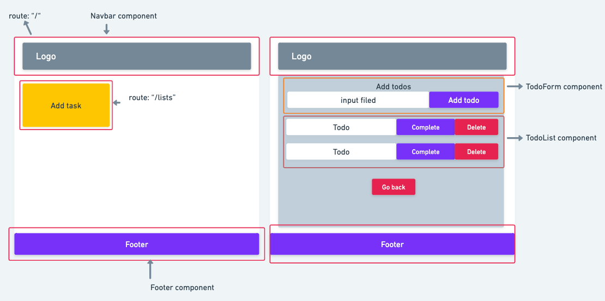

# React project : easyTodo

 

## project setup

---

- pages :
  - Home page : Landing page.
  - List page : Page that can allow users to add todos.
- Components:

  - Navbar : Redirecting users to the home page.
  - Todo form : Where users can add todos.
  - Todo list : Rederning todos.
